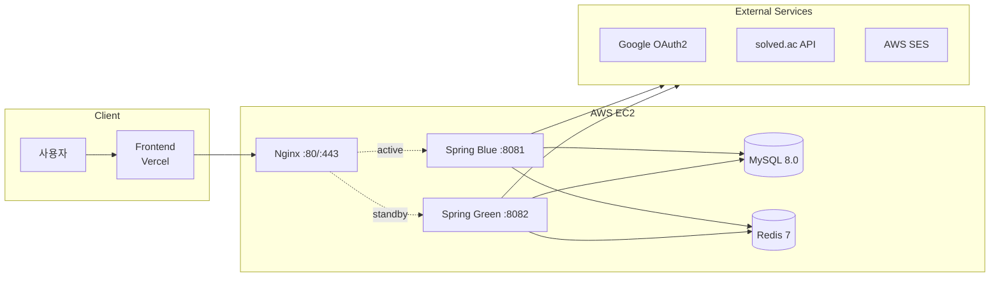
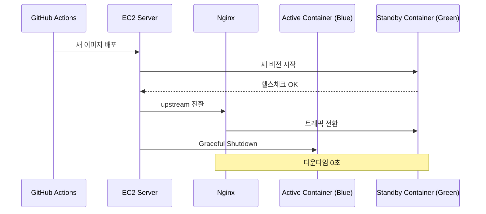
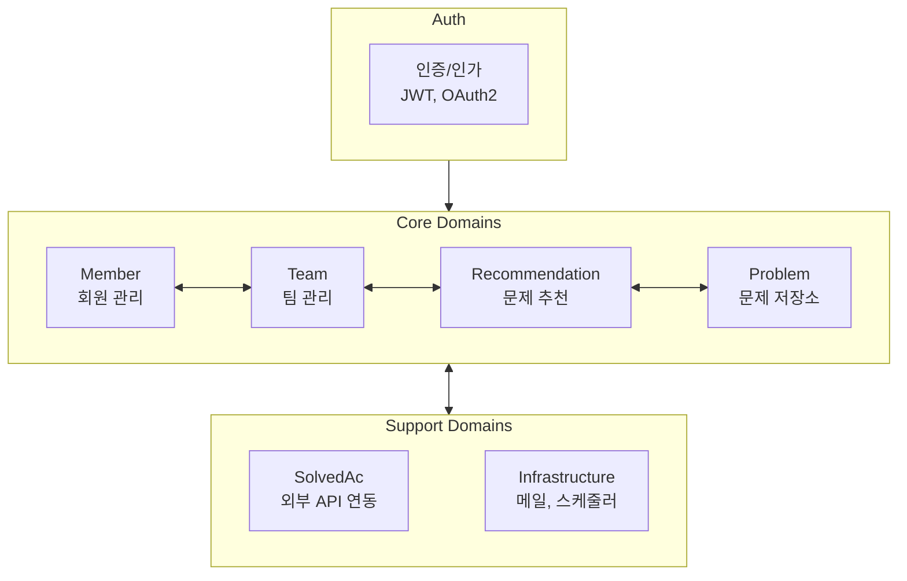
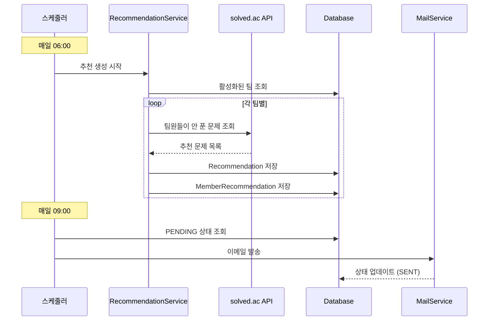

# Codemate

> 팀 기반 알고리즘 문제 추천 서비스

Codemate는 스터디 팀원들에게 매일 맞춤형 알고리즘 문제를 추천하고, 이메일로 발송하는 서비스입니다. [solved.ac](https://solved.ac) API와 연동하여 각 팀원이 아직 풀지 않은 문제 중 적절한 난이도의 문제를 선별합니다.

## 주요 기능

- **OAuth2 Google 로그인**: 간편한 소셜 로그인
- **팀 관리**: 팀 생성, 멤버 초대/수락/거절, 역할 관리
- **문제 추천 설정**: 난이도 프리셋, 요일별 추천 활성화
- **일일 문제 추천**: 매일 새벽 6시 자동 추천 생성
- **이메일 발송**: 오전 9시 추천 문제 이메일 알림
- **문제 해결 인증**: solved.ac API로 실시간 해결 여부 확인

## 기술 스택

| 분류 | 기술 |
|------|------|
| **Backend** | Spring Boot 3.2, Java 17 |
| **Database** | MySQL 8.0, Redis 7 |
| **Auth** | Spring Security, OAuth2, JWT |
| **Infra** | AWS EC2, Docker, Nginx |
| **CI/CD** | GitHub Actions, Docker Hub |
| **Monitoring** | Sentry |
| **External API** | solved.ac, Google OAuth2, AWS SES |

## 아키텍처

### 인프라 구성



> 📦 Spring Blue, Spring Green, MySQL, Redis는 각각 독립된 Docker 컨테이너로 배포됩니다.

### 블루-그린 무중단 배포



### 도메인 구조



| 도메인 | 책임 |
|--------|------|
| **Auth** | OAuth2 + JWT 인증, 토큰 관리 |
| **Member** | 회원 프로필, BOJ 핸들 인증, 문제 해결 추적 |
| **Team** | 팀 생성/삭제, 멤버 초대, 추천 설정 관리 |
| **Recommendation** | 문제 추천 생성, 이메일 발송 관리 |
| **Problem** | 알고리즘 문제 메타데이터 저장소 |
| **SolvedAc** | solved.ac API 연동 레이어 |
| **Infrastructure** | 메일 발송, 스케줄링 |

### 프로젝트 구조

```
src/main/java/com/ryu/studyhelper/
├── auth/                 # 인증/인가
├── member/               # 회원 관리
├── team/                 # 팀 관리
├── recommendation/       # 문제 추천
├── problem/              # 문제 저장소
├── solvedac/             # solved.ac 연동
├── infrastructure/       # 메일, 스케줄러
├── common/               # 공통 유틸리티
└── config/               # 설정 클래스
```

### 추천 시스템 데이터 흐름



## 배포

### CI/CD 파이프라인

```
GitHub Push → GitHub Actions → Docker Build/Push → EC2 SSH → deploy-blue-green.sh 실행
```

1. `main` 브랜치에 PR 머지
2. GitHub Actions가 Docker 이미지 빌드 및 Docker Hub 푸시
3. GitHub Actions가 EC2에 SSH 접속하여 블루-그린 배포 스크립트 실행

## 라이선스

Apache License 2.0